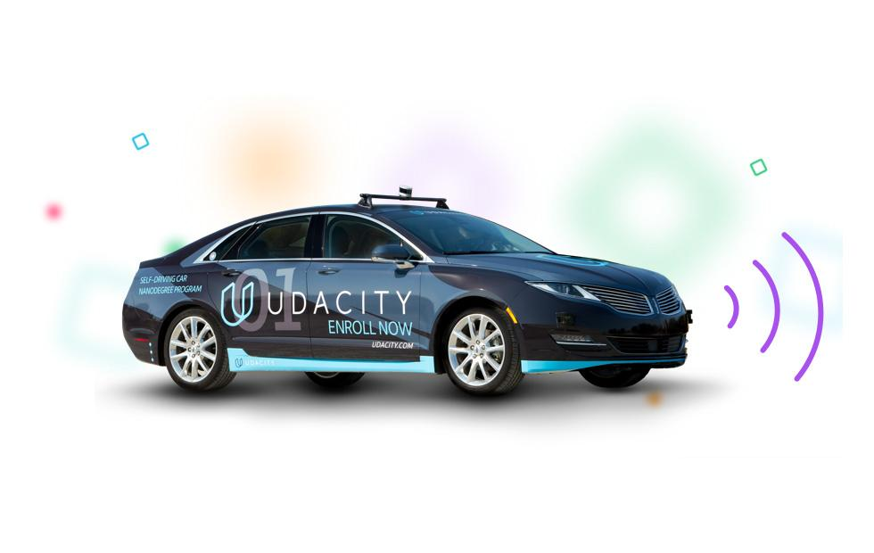
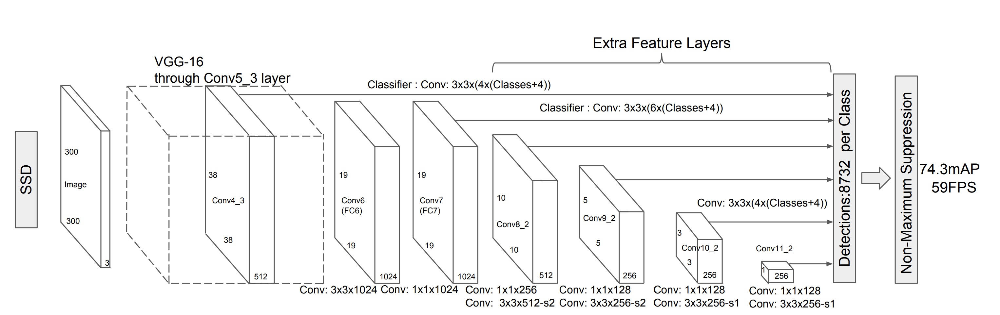
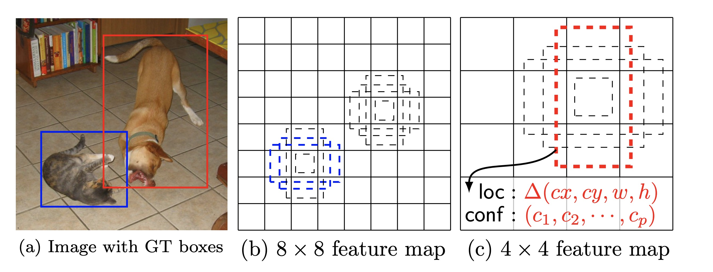
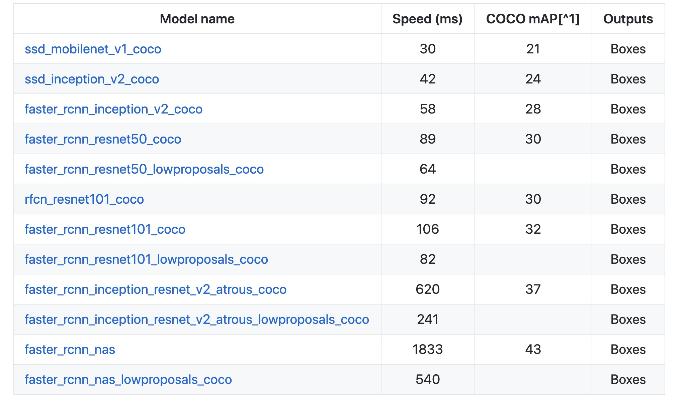
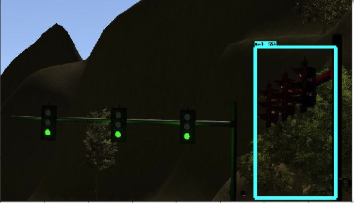

# Udacity Self-driving Car Nanodegree - System Integration



### Team Members
1. Sergiy Fefilatyev - Team Lead ([Email](mailto:sfefilatyev@gmail.com), Github: [sfefilatyev](https://github.com/sfefilatyev/)).
2. Dmitriy Litvak ([Email](mailto:dmit.litvak@gmail.com), Github: [dlitvak](https://github.com/dlitvak/)).
3. Devdatta Gangal ([Email](mailto:devdatta@gmail.com), Github: [devdatta-work](https://github.com/devdatta-work/)).
4. Reheman Baikejiang ([Email](mailto:bakikjan@gmail.com), Github: [bakijan](https://github.com/bakijan/)).
5. Devunuri Sai Praneeth ([Email](mailto:devunurisaipraneeth@gmail.com), Github: [saipraneethd](https://github.com/saipraneethd)).

### Goal
The [rubric](https://review.udacity.com/#!/rubrics/1140/view) of the Capstone project is quite straightforward - did the car navigate the track successfully? The submitted code must work successfully to navigate Carla around the test track.

### Architecture


We follow the architecture as prescribed in the class instructions. The project runs with [ROS](http://www.ros.org/) and is divided into the following modules :
 - `tl_detector` uses the camera to detect the traffic lights' color
 - `twist_controller` handles the control of the car
 - `waypoint_follower` makes sure the car follow the trajectory
 - `waypoint_loader` loads the route the car is going to follow
 - `waypoint_updater` adapts the car's route to the situation (eg. traffic light)

### Results
1. Runs successfully on the Highway (Simulator). See full video results [here](https://youtu.be/vRL9Pzjr3hE).


2. Runs successfully on the Test Lot (Simulator). See video results [here](https://www.youtube.com/watch?v=EGPor9flvVA)


3. Traffic light recognition runs successfully in ROS Bag replay from Carla. See full video demo [here](https://www.youtube.com/watch?v=g7SMkP_P3LU). At the time of submission we tested our software on a bag with all recorded sensors from [here](https://drive.google.com/uc?id=0B2_h37bMVw3iT0ZEdlF4N01QbHc&export=download). This bag belonged to [another team](https://darienmt.com/CarND-Capstone/).


### Installation instructions
* Clone project from from [https://github.com/sfefilatyev/CarND-Capstone](https://github.com/sfefilatyev/CarND-Capstone)
* Download and use the [simulator](https://github.com/udacity/CarND-Capstone/releases) provided by Udacity.
* The best results are obtained by *native* installation of ROS on a host machine. We cannot stress this fact enough, but beware of multitude issues if you go with other options. Native installation on a machine with pwoerful GPU is fast enough for live perception and is not affected by latency issues between Simulator & ROS (see below).
* Workspace provided by Udacity (Alternative Running Environment) - see project notes.
* VM & Simulator Installation (Alternative Running Environment)
    - Udacity provided [virtual machine](https://s3-us-west-1.amazonaws.com/udacity-selfdrivingcar/Udacity_VM_Base_V1.0.0.zip) with ROS (Kinetic - 1.12.14) and Dataspeed DBW already installed - settings at 2CPU, 2GB system memory and 25GB free space.
    - Simulator Downloaded the [Udacity Simulator](https://github.com/udacity/CarND-Capstone/releases)] on the client machine.  It works best in the "simple" version at 640 x 480
    - Setup port forwarding described [here](https://s3-us-west-1.amazonaws.com/udacity-selfdrivingcar/files/Port+Forwarding.pdf).                                
* Docker (Alternative Running Environment)
    - [Install Docker](https://docs.docker.com/engine/installation/)
    - Build the docker container
```bash
        docker build . -t capstone
```
    - Run the docker file
```bash
        docker run -p 4567:4567 -v $PWD:/capstone -v /tmp/log:/root/.ros/ --rm -it capstone
```

* Port Forwarding
We used instructions from [the course (3. Getting Started) here](https://s3-us-west-1.amazonaws.com/udacity-selfdrivingcar/files/Port+Forwarding.pdf) for port information forwarding

* Changes to the Requirements.txt
While debugging camera topic we stumbled on a the following bug:
[https://github.com/udacity/CarND-Capstone/issues/147](https://github.com/udacity/CarND-Capstone/issues/147) For Docker installation, we locally updated our requirements.txt with Pillow pointing to version 4.3 to address dependencies. This change is not part of the current submission due to strict guidance in this project for dependencies for Carla. We did not have to do such a change for Workspace engironment, VM, or native installation.

* Real world testing
At the time of submission, we used other team's bag, b/c Udacity's bag only provided training data, but not the messages. We downloaded a bag from [here](https://drive.google.com/uc?id=0B2_h37bMVw3iT0ZEdlF4N01QbHc&export=download) that belonged to [another team](https://darienmt.com/CarND-Capstone/).


### Other Issues we ran into
1. When we were on Docker installation, Requirements.txt was modified to point pillow to version 4.3 (see above).  We had an issue with cv.Bridge that was traced back to https://github.com/udacity/CarND-Capstone/issues/147.  This required upgrade to pillow version 4.3 - however this worked well for Workspace and native installation
    - We do want to call out that while Udacity mentions not to change the requirements.txt, you have used different kinds of settings yourself in the Virtual Workspace
        - Workspace provides CUDA v9.0, and not v8.0 as required
        - We also had to use Driver 4.15, and not 3.XX not as required.
2. We ran into issues with the car’s deceleration.  We observed crazy jerk after detection of the stop-light.  Seeking inspiration from  https://github.com/justinlee007/CarND-Capstone we adjusted the waypoints to ensure that the velocity was under the maximum possible velocity as given by v*v=2aS where a = deceleration and S = distance until the stop-line.
    - The maximum deceleration chosen was 0.5m/s*s initially.
    - The issue still persisted because the car now had a discrete drop in velocity for the first waypoint where correction needs to happen
    - We worked on many different solutions only to realize later that this behavior is consistent with physics.  
    - The first thing we changed was to tolerate higher deceleration (now changed to 5m/s*s which is 0.5G significantly less than 2G which is considered hard braking in industry)
    - Second thing we explore was to increase the lookahead from 50 waypoints to 100
3. We also stumbled upon the “SteeringReport” issue [https://knowledge.udacity.com/questions/46645](https://knowledge.udacity.com/questions/46645). The current install of DBW breaks because the steering_wheel_angle_cmd d field, which is populated in bridge.py no longer exists, and we had to update locally code in Bridge-node to address issue described in [https://github.com/udacity/CarND-Capstone/issues/306](https://github.com/udacity/CarND-Capstone/issues/306). This results in field steering_wheel_angle_cmd changed to steering_wheel_angle inside SteeringReport structure.
4. We also observed Latency between ROS & simulator when camera is turned on. This issue has been reported multiple times, but seems to be unaddressed by Udacity. The issue is well described in [https://github.com/udacity/CarND-Capstone/issues/266](https://github.com/udacity/CarND-Capstone/issues/266). The issue affects both, provided Workspace and Docker environment. It did not seem to affect the virtual machine environment. It did not affect native installation.


## Traffic Light Classification (TLC) with Single Shot Multibox Detector (SSD)

_Disclaimer: Due to limited time and GPU resources, we borrowed a fully trained [model](https://github.com/alex-lechner/Traffic-Light-Classification/tree/master/models)
 from another team. We skipped the data generation and labeling by borrowing the group's TFRecord files
 [link](https://github.com/alex-lechner/Traffic-Light-Classification/blob/master/README.md#1-the-lazy-approach).  We have also learned how to
train a model using [Object Detection Model Zoo](https://github.com/tensorflow/models/blob/r1.5/research/object_detection/g3doc/detection_model_zoo.md)
from the same group's [tutorial](https://github.com/alex-lechner/Traffic-Light-Classification/blob/master/README.md),
for which we are very grateful._

### TLC Intro

The goal of TLC was to train a model for quick classification of the traffic lights in the simulator environment and in
Carla autonomous driving vehicle in the real Udacity parking lot.

### TLC Implementation

After a quick Google search and reviewing the Object Detection Lab in the Udacity lectures, we realized that
we would not have to train our model from scratch.  There's already a large library of object detection models hosted by
Tensorflow and contributed by Google [link](https://github.com/tensorflow/models/tree/r1.5/research/object_detection).
We chose SSD model based on the report by Alex Lechner group that this was the optimal model for them.

**Figure:  SSD Model**


SSD is end-to-end model [ref](https://arxiv.org/pdf/1512.02325.pdf), meaning it is trained to detect and classify an object in the picture
at the same time.  SSD is a CNN built on the base of VGG16. It accepts images of any size and uses kernels to scan them for features at different
levels of detail.  SSD gradually shrinks the feature map size and increase the depth as it goes to the deeper layers.
The deep layers cover larger receptive fields and construct more abstract representation, while the shallow layers cover
smaller receptive fields.  SSD uses shallow layers to predict small/further objects and deeper layers to predict big objects.
As can be seen in the diagram above, the result of these predictions at different levels are a bunch of bounding boxes.
The boxes are combined around the object into a single bounding box which is output together with the object classification.

**Figure:  SSD Feature Layer Boxes**


We decided to adopt another group's ([model](https://github.com/alex-lechner/Traffic-Light-Classification/tree/master/models))
just to try the whole pipeline together.  As we found out, that model turned out to be too slow in a simulator working on CPU.
It took 1-1.5 second to classify a single image posted to _/image_color_ topic.  Because the Udacity skeleton code was calling the TLClassifier
for every image, TLDetector thread was lagging behind trying to post every light detection to _/traffic_waypoint_ topic.
To deal with this issue, we introduced *tl_detector_rate* and *tl_start_detection_distance* properties in [yaml config](ros/src/tl_detector/sim_traffic_light_config.yaml).
*tl_detector_rate* sets number of times per second the images are classified (at least 3 detections have to happen to publish to _/traffic_waypoint_ topic).
*tl_start_detection_distance* sets the distance before the next published traffic light stop line at which the classifier is getting invoked.
It might be a bit tricky to pick a good set of parameters based on the host machine CPU speed.  We have not implemented the code to do this based on the system properties.
Those parameters are less important when running on a powerful GPU; though, it might be a good idea to adjust them to save some cycles.
For e.g., the default *tl_start_detection_distance* of 100 m. means that TLClassifier works all the time in the parking lot.

We have spent some time researching our own model to train as well.  Looking at the
[Model Zoo]((https://github.com/tensorflow/models/blob/r1.5/research/object_detection/g3doc/detection_model_zoo.md)), we noticed
the mobilenet as the next best model.

**Figure: Model Zoo Stats**


The Speed column is the duration of inference on the researcher's GPU.  _mAP_ refers to the accuracy of the inference.
So, while *ssd_mobilenet_v1_coco* model lost 12.5% in accuracy compared to *ssd_inception_v2_coco*, it gained 29% in speed.  

As the model we adopted from the other group seemed to have plenty of accuracy, we set out to train the mobilenet model for 20K
steps.  Unfortunately, after training for many hours in Udacity workspace, we found that the accuracy on the test set was too low.
While some images were classified correctly, other were missed or completely misclassified.



Running out of time we settled on using Alex Lechner group's model.  You can find our own exploits training mobilenet at our [repo](https://github.com/dlitvak/TL_Classifier)

### Insights on other things
* Traffic Light detector
We used a borrowed trained Single Shot Detector model for the detector/classifier (see above).
* Twist Controller
We followed the project review notes precisely. The project reivew notes provide full implementation of the node which we reproduced in this submission with some edits.
* Waypoint Loader
We only were chaning the config `ros/src/waypoint_loader/launch/waypoint_loader.launch` to switch waypoints source between large test track and small parking lot.
* Waypoint Updater
Again, We followed the project review instructions precisely on this topic. The WayPoint Updater is subscribed to /base_waypoints, /current_pose, /traffic_waypoint and publishes modified waypoints to /final_waypoint. We selected the number of points to publish as 50.


### Other instructions
* Real world testing instructions
1. Download [testing bag](https://drive.google.com/uc?id=0B2_h37bMVw3iT0ZEdlF4N01QbHc&export=download) that was recorded by Udacity for [another team](https://darienmt.com/CarND-Capstone/) - At the time fo submission we used their test data.
2. Unzip the file
```bash
unzip traffic_light_bag_file.zip
```
3. Play the bag file
```bash
rosbag play -l traffic_light_bag_file/traffic_light_training.bag
```
4. Launch the project in site mode
```bash
cd CarND-Capstone/ros
roslaunch launch/site.launch
```
5. Launch RViz to motitor imagery from the bag as it feeds the our software.
6. Confirm that traffic light detection works on real life images through console messages.
